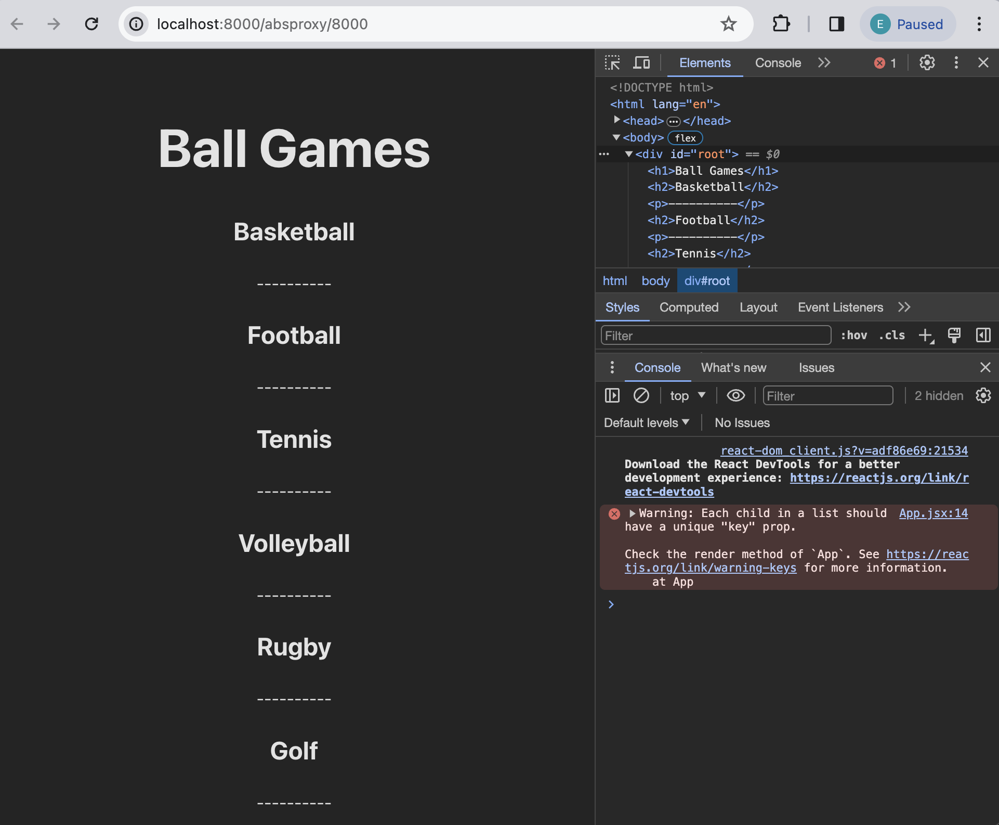
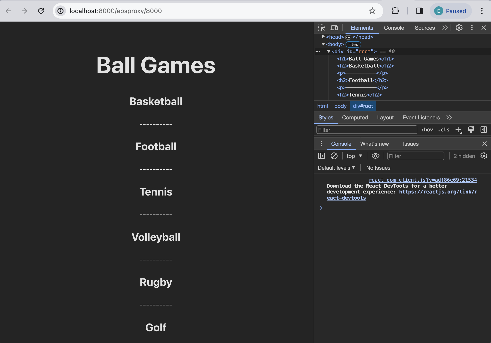

# React - Introduction to React Fragment

## Setup 
Before we begin writing code, let's setup the project and install all necesarry packages.
Open a new Terminal window and do the following steps:

1. Go to `calab` directory:
    ```
    cd calab
    ```
2. Install npm packages:
    ```
    npm install
    ```
3. Start the application:
    ```
    npm run dev
    ```
    You should see the development server being started:
    []() 

    If you open the `Local` URL in a new browser tab, you should see the follwoing:
    []()    


## Steps 

### The Problem:
JSX expression that components render has a constraint that it should always be one element or wrapped by a parent element wrapper. Wrapping elements with a `div` tag would add extra unnecessary nodes to the DOM.

### The Solution:
Fragments let you group a list of children without adding extra nodes to the DOM.

### Short Syntax
You can use `<></>` the same way you’d use any other element except that it doesn’t support keys or attributes.


1. Open `App.jsx` file and inspect the current JSX that App function is returning. Can you spot the Empty tag here?

2. Let's push `<></>` to the limit. Declare a list of sports that are played with a ball.
    ```
      const sports = [
        'Basketball',
        'Football',
        'Tennis',
        'Volleyball',
        'Rugby',
        'Golf',
        'Baseball'
    ];
    ```

3. Change text in the `<h1>` tag.
    ```
    <h1>Ball Games</h1>
    ```

4. Just below `<h1>` element add the following code that maps each sport from the list of sports declared previously to the JSX expresion that contains multiuple elements.
    ```
          {sports.map((sport, index) => (
          <>
            <h2>{sport}</h2>
            <p>----------</p>
          </>
        ))}
    ```
4. Use the Chrome developer tools to inspect for any errors. 
    -   Open browser window where your react application is running. 
    -   Open developer tools
    -   Check errors in a console
        []()
        You will notice that empty Tag does not support keys. 


### Keyed Fragments

Fragments declared with the explicit <React.Fragment> syntax may have keys.

1. Import React Framework from React.
    - At the top of the `App.jsx` import React Framework.
        ```
        import React, {Fragment} from 'react';
        ```

2. Make changes to map defined previously.
    - replace empty tag `<>` wrapper with the `Fragment`.
    - Add key to each Fragment element.
        ```
        {sports.map((sport, index) => (
            <Fragment key={index}>
            <h2>{sport}</h2>
            <p>----------</p>
            </Fragment>
        ))}
        ```
4. Use the Chrome developer tools to inspect for any errors. 
    -   Open browser window where your react application is running. 
    -   Open developer tools
    -   Check errors in a console
    []()
    You should notice that previously seen unique key error is now gone. 

